

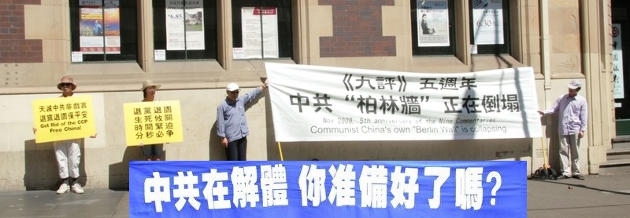

<h3 align=center>翻墙必看 视频 http://61.228.116.242 </h3>
 

 
  

 <a name=list><b>目錄</b>

 <table>
 <tr><td width=640>
 <a href=#◆>海外“风景点”中共国安国保610警察三退</a></td>
  <td width=240><a href=#◆>大紀元新聞</a></td>
 </tr>
 
 <tr><td width=640>
 <a href=#1>中国人欧洲之旅 所见所闻所行</a></td>
  <td width=240><a href=#1>大紀元新聞</a></td>
 </tr>
 
 </table>
  <a href=#list><h4 align="right">回目錄</h4></a>
 

 
 
 
 <a name=#◆><h2 align="center"><b> 海外“风景点”中共国安国保610警察三退 </b></h2>
 

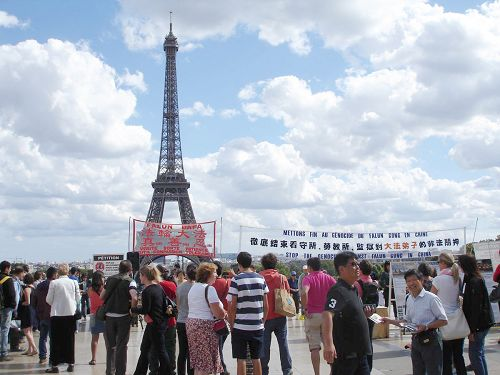

  
 大陆游客在世界各地的著名旅游景点可以听闻法轮功真相。图为法国埃菲尔铁塔（大纪元） 

  

 【大纪元2018年05月24日讯】（大纪元记者罗琼综合报导）“一个幽灵，共产主义的幽灵，在欧洲游荡。” 这是《共产党宣言》的开场白。在东西方传统文化中幽灵代表着魔鬼与邪恶，它来到中国后，中共实施暴政60多年，夺走了八千万中国同胞的生命。  

 2004年11月19日，大纪元发表了系列社论《九评共产党》，这本书第一次全面、系统的揭示了中共的真实历史，使其邪恶、谎言、残暴得以全面曝光。并引发了中国民众退出中共党、团、队组织的“三退”大潮。

迄今为止，在大纪元退党网站声明三退的人数已超过三亿。

 在“三退”的人群中有原中共驻悉尼总领事馆一等秘书陈用林，有被称为“中国良心”的著名律师高智晟，有前中国人民日报主编邱明伟，他是第一位用真名退出中共宣传部附属组织的在职官员。还有前中共国家安全部官员李凤智，他是第一位公开脱离中共的谍报系统成员等等。

三退还获得国际社会的关注和支持。

2011年9月23日，赛迪斯‧麦考特(Thaddeus G. McCotter)等八位美国国会众议员联名提交众议院第416号决议案。决议在谴责中共歧视、骚扰、监禁、酷刑折磨、处决良心犯的同时，声援大纪元时报《九评共产党》社论引发的一亿中国民众的三退大潮。

十多年来，作为修炼人的法轮功学员深知善恶有报，天灭中共的天理，为帮助中国人在大难来临时保平安， 他们成为三退义工的主力，坚持在海外旅游景点帮助中国人三退。他们的信息台、展板、横幅形成一道道独特的“风景点”，吸引了成千上万的大陆游客。明真相的人们纷纷退出中共党、团、队。

 

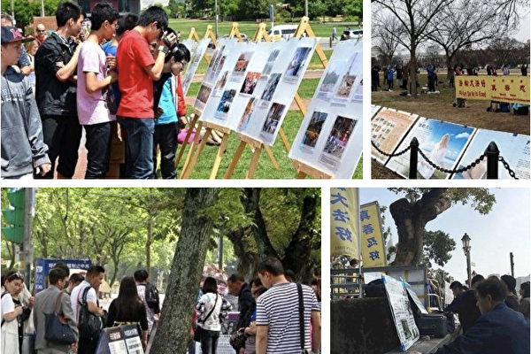

  
 大陆游客在世界各地的著名旅游景点可以听闻法轮功真相。左上：美国费城自由钟独立宫广场，右上：华盛顿DC宇航馆对街，左下：台北“国父纪念馆”景点，右下：澳门景点。（大纪元合成图） 

  

<b> 一包“退党材料”</b>
 

 

 中国城是每位到访澳洲布里斯本的中国游客必参观的景点，每天都能见到一辆辆满载中国人的游览车到来。 

一天，法轮功学员们一如既往地在中国城向游客派发法轮功真相资料，一位刚下车的中国游客主动向法轮功学员走来，同时偷偷地塞给了法轮功学员一个小布包。

这名男性中国游客是第一个从车上下来，直接朝一法轮功女学员走去。她和平时一样，将法轮功的真相资料递给了他，那名男子偷偷塞给了她一个小布包，只说了四个字：“退党材料。”然后，他就继续往前走了。

那位法轮功学员打开布包一看，里面放着一张纸，上面工整地写着来自中国多省共43个人的退党名单。原来那位男子是带着来自北京、天津、湖南、新疆、山西、甘肃和广州的43位中国人的重托和希望来到布里斯本。

 
 

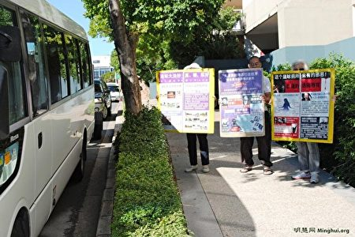

  
 法轮功学员给来到澳洲布里斯本旅游的大陆人展示法轮功真相展板。（明慧网） 

  

 
 

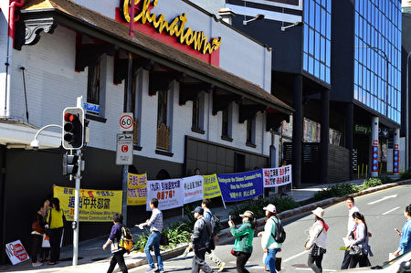

  
来到里斯本的中国游客看到并拍照法轮功学员的真相横幅。（明慧网） 

  

 <b>一副部级、八个局级官员退党</b>
 

 2015年在欧洲的一个旅游景点上一名三退义工遇到了一群“老干部”模样的大陆游客，就问他们是否是老干部，有人调侃说他们都是农民。义工不相信，后来得知他们都是局级干部，其中有一位是副部级。

他们每人都要了份法轮功真相报，坐在石凳子上看。义工看到他们都在看头版“周永康刺杀胡锦涛、习近平内幕”，就问他们周永康为什么要刺杀胡习，没人吭声。义工告诉他们：“是江泽民对他俩不放心，换上薄熙来、周永康、徐才厚这些亲信，好继续迫害法轮功，保证自己不被清算。”

义工又问他们是否知道胡习和薄周之间在博弈什么，仍然没人回答。义工说：“分歧就在法轮功问题上，江泽民残酷迫害法轮功，活摘法轮功学员器官犯下反人类罪。”她接着说，习近平不糊涂，他不给江泽民背黑锅，所以习江斗才你死我活的 ⋯⋯

义工讲了习近平夫妇2014年出访新西兰，碰到法轮功修炼学员手举“法轮大法好”的标语时，他们微笑着从车里挥手致意的事。听到这里，看报的人摘下花镜开始议论，和义工互动起来。

义工说：“你们都是老干部，比我了解共产党的底细，法轮功被迫害的真相。中共正走向解体。现在谁不骂江泽民，谁不骂中共？都在诅咒它们！中共解体还有悬念吗？”这帮老人都摇头。

义工说：“那好，驱除马列邪灵，求神佛保祐。我给你们各位起个化名，在大纪元网站登记退党，躲劫难，保平安，过个好的晚年，选个好的未来？”

沉默片刻后，有一个说“我退”，接下来，除一人说自己太老了，无所谓以外，其余都明确表明要退党。

 

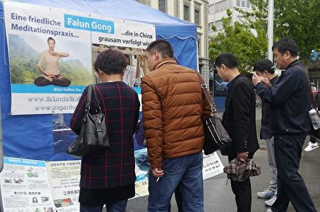

  
 中国游客在瑞士卢赛恩著名景点狮子像（Lion Monument）的法轮功信息摊位上了解真相，并拍照。（明慧网） 

  

 

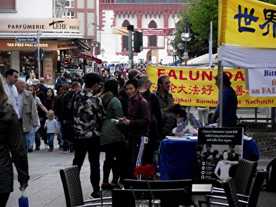

  
 每天有大量的大陆游客在法兰克福市内柏林大道的景点可以看到法轮功信息台上的真相横幅、展板。（明慧网） 

  

 <b>国安人员遭报应 郑重声明退党</b>
  

 袁平是美国纽约的三退义工，六年来一直在中领馆前与旅游景点上向大陆人讲真相、劝三退。她认识一个从中国大陆来的国安人员四年之久。这位国安人员经常到景点给义工们拍照，还辱骂他们，语言污秽、难听。让他三退就更谈不上了。  

但义工们还是善待他，坚持给他讲法轮功真相，取得了他的信任。后来，他向义工们亮出了自己的身份，他是天津人，是中共派过来的一名国安，专门在景点给讲真相的义工们拍照。

前不久，他遇到了车祸，胸部骨折，他跑来找袁平急切地要三退，说：“我遭报应了，快给我退党”。他还说，他想起了义工们告诉他的常念“法轮大法好”。

他举起拳头说，要退出共产党组织。袁平给他起了一个化名做了三退声明。

  

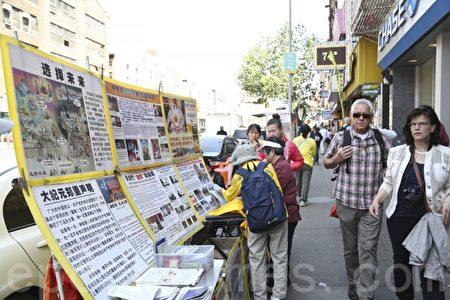

  
 纽约景点上的法轮功真相摊位。（明慧网） 

  

 <b>国保大队长退党</b>
  

 2016年初，泰国景点来了一个男游客，三四十岁，很精明的样子，法轮功学员陈先生上去先给他发资料。他强硬地说：“你知道我是干什么的吗，你胆子这么大，我是××省国保大队的，专门管你们法轮功。”旁边的人赶紧说，他是国保大队的头，是“610”的（江泽民成立的专门迫害法轮功的非法组织）。 

陈先生心想，那就更要跟他讲真相了，于是跟他讲法轮功是什么、法轮功洪传世界、中共迫害法轮功等等真相，最后讲到周永康被抓起来了，他真正的罪行其实是迫害法轮功，他活摘法轮功学员器官，天理难容。

“修炼法轮功的都是好人，修‘真、善、忍’，他们没有违法。迫害法轮功是要遭报应的，现在暂时没事，不等于以后没报应。”

陈先生告诉他，周永康遭恶报了，三退就是不要成为周永康之流，不要成为中共的替罪羊，赶紧退出来保平安。

国保大队长渐渐听明白了，一改之前的蛮横，变得很诚恳，同意退党。

陈先生再三叮嘱他：“回去千万不能再迫害法轮功了，要遭报应的”、“你要帮助法轮功”，他连声说好。 

 

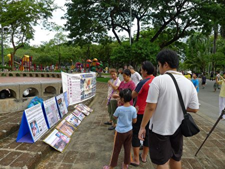

  
 大陆游客在泰国景点阅读法轮功真相展板。（明慧网） 

  

 <b>“610”人员同意三退</b>
  

 巴黎拉菲耶商场（Galeries Lafayette）是百年老字号商场，每天都有大批的中国游客。法轮功学员陈女士曾碰到一位年逾花甲的男游客，走上前去个他真相报纸。

男游客说：“报纸我看了，不瞒您说，我是公安局、‘610’的，就是管你们法轮功的。我现在退休了，我可从没有迫害法轮功。炼法轮功的人都很好，唯一一点我接受不了，就是参与政治。”

陈女士给他解释：“讲真相不是参与政治，我们没有任何政治目的。如果江泽民一伙不迫害我们，不抓我们，不把我们弄得家破人亡，妻离子散，甚至活摘器官，我们用得着出来说吗？这叫参与政治吗？总不能说杀人犯可以为所欲为，被杀者说一下就叫参与政治吧？”

男游客想了想同意她的观点。陈女士就劝他三退，他明确表示同意。 

 
  

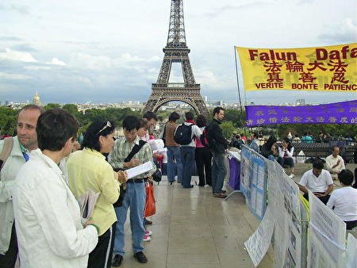

  
 在埃菲尔铁塔前大陆游客看法轮功真相展板。（明慧网） 

  

   

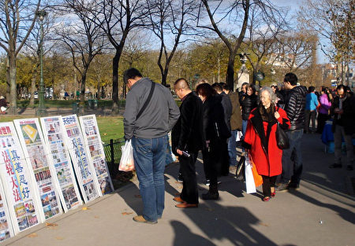

  
 巴黎埃菲尔铁塔每天都吸引著世界各地的游客，三退义工们每天都在这里为中国游客讲法轮功真相劝三退。（明慧网） 

  

  <b>明白真相的警察</b>
  

  在瑞士的景点上，三退义工潘女士遇到一位从大陆家乡来的40多岁的男士，得知他是个警察，就给他讲真相，从吉林的大洪水到甘肃的山体滑坡，从天灭中共谈到退党，并劝他退党。

那位警察很犹豫，担心他要退了就没饭碗了，一家人没吃的。潘女士说：“没关系，你今天的片警是你的工作，退党是个人的选择，不需要上报领导，不影响你的工作，我现在就可以帮你退。”

潘女士还说，他的工作条件可以保护法轮功学员，如果他这么做，那就是做大好事，会得福报。反之，他也可以听恶党的，无理抓捕法轮功学员，做恶事，那一定会遭恶报。

他连连点头，潘女士就给他起了个化名‘乡缘’三退，他欣然接受。

当他得知潘女士是修炼法轮功的，就害怕随他出来旅游的那群人知道了。潘女士说：“别怕，你做好事，神佛会保祐你的。”后来他招手叫来一位女士，是他太太，他让潘女士也帮他太太退党。

然后，男士向一群人走去，潘女士紧跟着过去。男士劝那些人要抓住机会，潘女士马上接过话题，告诉他们如何能在天灾人祸前保平安，劝他们三退，结果七八个人全都做了三退。  

  

  
 在瑞士景点大陆游客呼朋唤友成群三退。（明慧网） 

  

 <b>监狱“包夹”纽约的邂逅</b>
 

 去年，纽约另一位三退义工、法轮功学员王慧娟在纽约帝国大厦前讲真相时，遇到了以前在大陆被关押时看管她的包夹（或“帮控”、“帮教”，专门管控法轮功学员），对方看到王慧娟后非常惊喜。王慧娟给她讲了真相，她欣然接受，而且与她的儿子一起做了三退。 

自中共1999年7月迫害法轮功以来， 中国大陆监狱、看守所、拘留所、劳教所、洗脑班等大量非法关押法轮功学员，他们常常遭受“包夹”的监控、迫害。有些“包夹”通过和法轮功学员接触后，亲眼了解到法轮功学员是好人，就改变了对这些学员的敌对态度，甚至暗中帮助他们。 

 

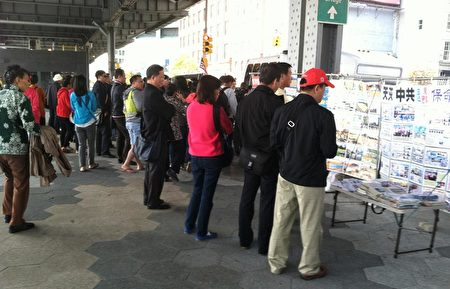

  
 大陆游客从这里去纽约自由岛观光自由女神像。（明慧网） 

  

 
 <b>老干部流泪鞠躬感谢</b>
  

 来自河南许昌的退休老干部孙先生和妻子、儿子、儿媳妇及女儿一家五口，来到了多伦多皇后公园，遇上了法轮功学员张女士，在听真相的过程中经过了一番风波。

刚开始时张女士跟他讲中共几十年来给中国人民带来的灾难和痛苦，他一听就愤怒了，气冲冲地握著拳头要打张女士。

张女士就平静地对他说：“老先生，请您不要动气，这对身体不好。其实我为什么要跟您说这些呢，很简单就是为了您的平安。您看现在世界上哪里还有人像法轮功学员这样挨着打受着骂，还要为别人的平安天天苦口婆心地让您明白怎么样才能平安呢？我不要你一分钱，只想给你个平安，请您就静下心来听听我讲的。”

老先生的态度有些缓和了，他要张女士举个能说服他的例子。

张女士给他讲了一个故事。她的一个女邻居因听信中共谎言欺骗，不让张女士跟她联系。前几年她患了癌症，只有三个月活的命，医生劝她儿子带她到处游玩一下。她儿子想起了法轮功，就带她到海外找法轮功。她开始炼法轮功，结果一个月后她的癌症治愈了。

老先生认真听着，沉思了一下问：“你们不是在天安门都把自己烧了吗？”

张女士告诉他，那是中共炮制的伪案，是为了抹黑法轮功，让人误以为修炼法轮功会使人作出极端的举动⋯⋯最后，那位退休干部流着泪说：“怎么能做出这么伤天害理的事啊？！”

最后一家五口都做了三退，老先生流泪抱拳，鞠躬90度说：“谢谢！非常感谢！”

 
  

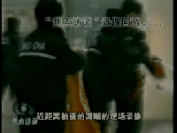

让录像说话：自-焚者刘春玲是被警察用灭火器打死的--自-焚伪案疑点-女主角被当场灭口

 

<a href="https://github.com/bcdz/true01/blob/master/mp4/20170123_000925-video.mp4?raw=true"> “天安门真相” 影片下载</a>
 

<b> 基督徒三退</b>
  

 一天，一辆面包车来到芬兰西贝柳斯景点，从里面走出来五六个中国游客，法轮功学员迎了上去。一位男士说，他在香港就看到有法轮功的摊位，但是因为忙没过去看，不知道是咋回事。义工在给他们几个人讲完真相后，又赠送光盘和资料。他们做了三退。

有一个人是基督徒，说自己有神管，学员说：“信得虔诚，不能一只脚踏两只船（信神还是信宣传无神论的党），你不退出邪党，神无法管你。”这个基督徒明白后做了三退。 

 

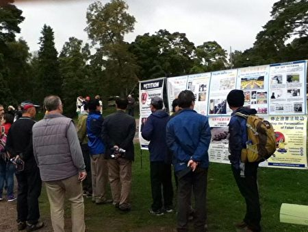

设在芬兰西贝柳斯公园的法轮功真相展板吸引了大陆游客。（明慧网）

 

 <b>中科院一群年轻人退党</b>
  

 2015年在欧洲的旅游景点上一位三退义工遇到中科院的一群年轻人，他们结伴出来过年。说到春晚，义工问今年的节目怎么样？有人告诉她春晚没意思。义工就从春晚讲到央视怎么成了中共高层的后宫，李东生、周永康、徐才厚和央视的关系，天安门“自焚”伪案是怎么在央视出炉的，江泽民流氓集团是怎么构陷法轮功、煽动仇恨的  。

这些年轻人没发表评论，但是都静静地听着，没打断义工的话。

义工说：“看得出来，你们对中共不感兴趣。但是，不能麻木不仁，要有知识分子的良心，分清善恶。现在有近二亿中国人三退，难道这些人都糊涂、都傻、都愚昧？三退保平安，你自己的平安你不要吗？”

义工接着问：“入过党吗？”一群人几乎异口同声地说：“我们都是党员。”义工说：“我给你们每人起个化名退党？”个个答应得很干脆，都说：“谢谢阿姨！”#

  

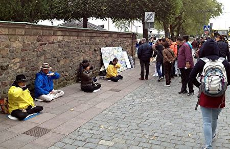

斯德哥尔摩市政厅位于瑞典首都市中心的梅拉伦湖畔，每年诺贝尔奖颁奖晚宴都在这里举行。这里常年吸引著大批来自世界各地的游客参观浏览。大陆游客仔细阅读法轮功真相展板。（明慧网）

 

 
   

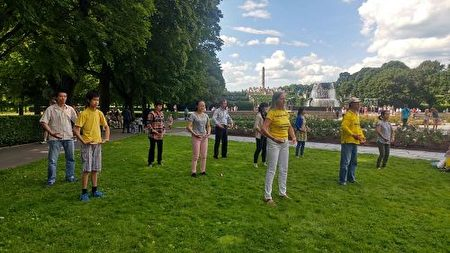

位于挪威首都奥斯陆的维格兰雕塑公园是游客们必不可少的参观景点之一，这里也是法轮功学员帮中国人三退的地方。（明慧网）

 

 
 <b>海外更多“风景点”</b>
  

 
 

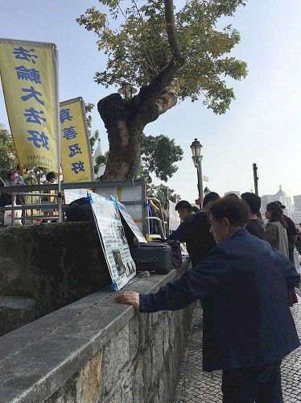

2018年2月16日至19日，大批的中国大陆游客从内地各省市到暖和的澳门过年，他们在景点上仔细阅读法轮功真相展板。（明慧网）

 

 
  

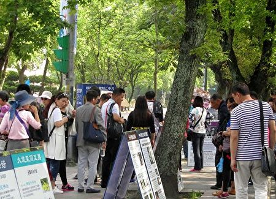

台北“国父纪念馆”景点的法轮功真相吸引大陆游客的关注。（明慧网）

 

 
 

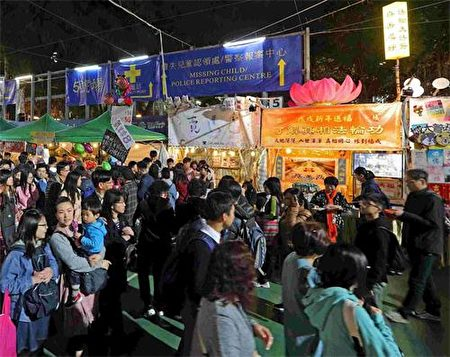

2018年2月，香港法轮功学员在维园年宵市场开设的法轮功真相摊位，深受民众欢迎，其中不乏大陆游人。（明慧网）

 

 
  

香港维多利亚公园附近的真相展板点，许多民众驻足观看法轮功真相。（明慧网）

 

 
  

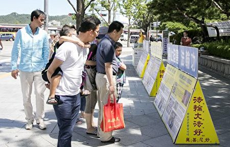

首尔社稷公园位于韩国首尔的中区，是首尔市内公园中最多国宝级宝物的公园，也是中国游客喜爱的观光地。（明慧网）

 

 
  

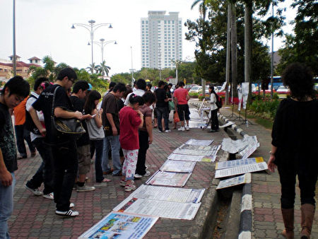

马里西亚的马六甲古城景点是新马泰旅游的必经之地，在节假日里，有大量的中国游客到此游玩。（明慧网）

 

 
  

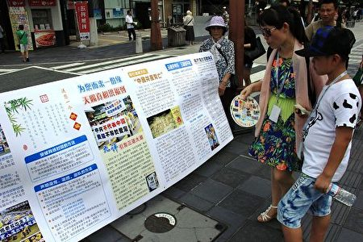

法轮功学员在日本福冈景点向大陆游客讲真相。（明慧网）

 

 
 

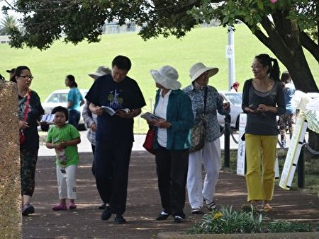

在新西兰奥克兰著名风景点米慎湾（Mission Bay），法轮功学员向中国游客讲述法轮功真相。（明慧网）

 

 
  

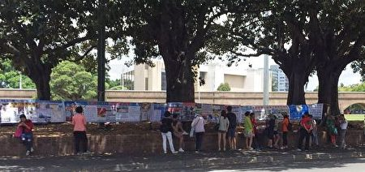

在澳大利亚悉尼鱼市场（Sydney Fish Market）旅游景点前，中国大陆游客观看法轮功真相展板。（明慧网）

 

 
  

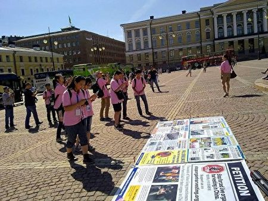

在芬兰议会广场上，大陆学生了解法轮功真相，拍照横幅、展板。（明慧网）

 

 
 

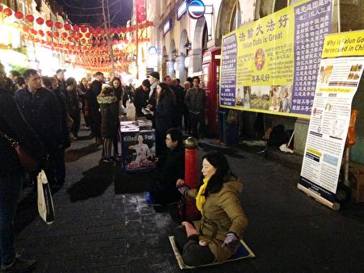

英国伦敦唐人街上的法轮功真相信息台。（明慧网）

 

 
 

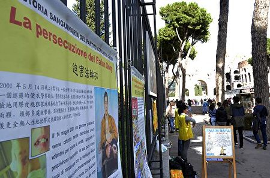

意大利罗马的角斗场和城中之国梵蒂冈是世界著名的旅游景点，也是大陆游客必到的观光地。（明慧网）

 

 
 

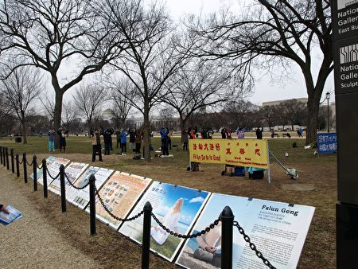

华盛顿DC法轮功学员在宇航馆马路的对面设立的真相点。（明慧网）

 

 
 

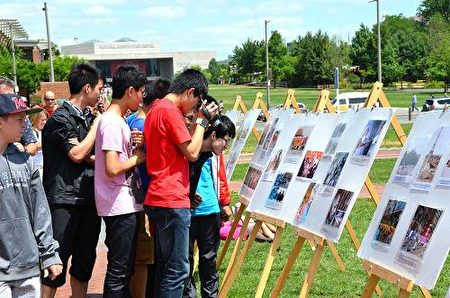

在美国独立自由精神的发源地──费城自由钟独立宫广场上，来自中国大陆的游客争相阅读介绍法轮功和反迫害的真相展板，索要真相资料，并拍照、录像。在这里义工们帮中国人三退保平安（明慧网）

 

 
 资料来源：明慧网
 
 
 
 <a href=#list><h4 align="right">回目錄</h4></a>
 

 
 
 <a name=1><h2 align="center"><b>中国人欧洲之旅 所见所闻所行</b></h2>
 

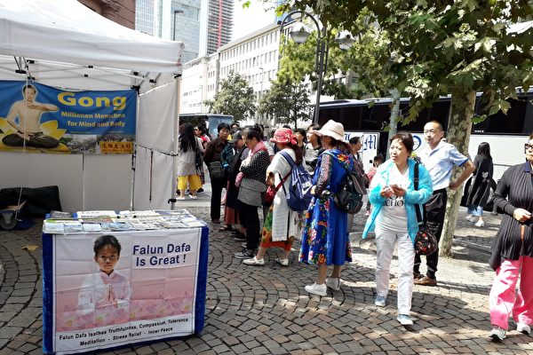

  
 在法兰克福保罗广场中国游客阅读法轮功真相展板。（法轮功学员提供） 

  

 
 【大纪元2018年10月02日讯】壮观的游行队伍从布拉格老城穿过，沿途被熙熙攘攘的人群围观、拍照。天国乐团、仙女队、腰鼓队⋯⋯美不胜收。游行队伍中展示出一幅幅醒目的横幅：“法轮大法好”、“世界需要真善忍”、“停止迫害”、“回归传统 人类才有希望”。

 
 9月28日，来自欧洲的法轮功学员在布拉格举行了千人大游行。

一组华人一直在观看游行队伍，脸上带着惊讶。当法轮功学员给他们递上报纸时，他们中有人起哄，不接。

法轮功学员说：中共把修炼“真、善、忍”的法轮功学员关入监狱，迫害好人。人在做，天在看！好好看看游行中的法轮功学员，全世界法轮功学员都可以自由炼功，为什么在中国就不行？
 
 听罢，其中一位60岁的男士说：“我理解，我明白。”

学员得知他入过党，告诉他，入党时人要宣誓，把你的一生献给所谓的共产主义事业，把生命献给它，就等于卖身于它，不退出来，就没解除这个誓约，就没有平安和未来。“给你起个化名，赶快退了吧？”

男士爽快地答应了。

《共产党宣言》开篇写着“一个幽灵，共产主义的幽灵，在欧洲上空游荡。”幽灵是魔鬼的象征，它到中国后毒害几代民众，和平时期的历次政治运动更夺走了八千万人的生命。

2004年11月19日，大纪元发表系列社论《九评共产党》，第一次全面系统地揭示了中共的真实历史，曝光了中共的邪恶本性，引发中国民众的“三退”大潮。

截至今年10月2日，在大纪元网站上已有3.16亿华人做三退声明（退出中共党、团、队组织）。

欧洲旅游景点是大陆民众喜爱的观光之地，那里也是法轮功学员给中国游客讲真相、劝“三退”的地方。

<b>布拉格大游行 华人喜“三退”</b>

 

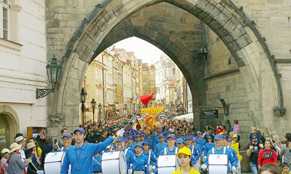

  
 浩荡的游行队伍穿过老城。（法轮功学员提供）

  

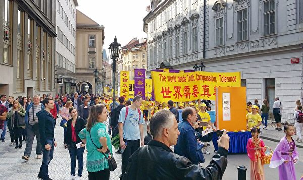

  
 游行队伍的横幅方队。（法轮功学员提供）

  

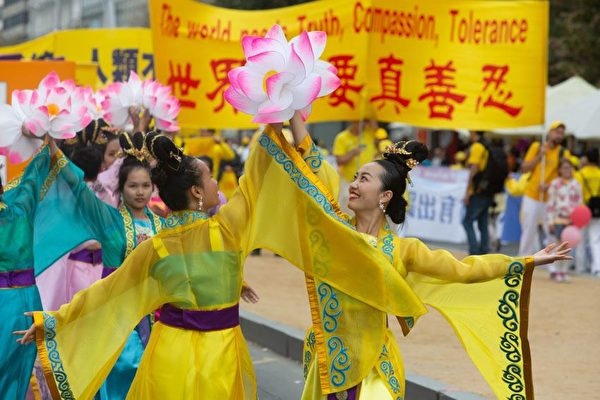

  
 游行队伍中法轮功学员的仙女舞蹈方阵。（明慧网）

  

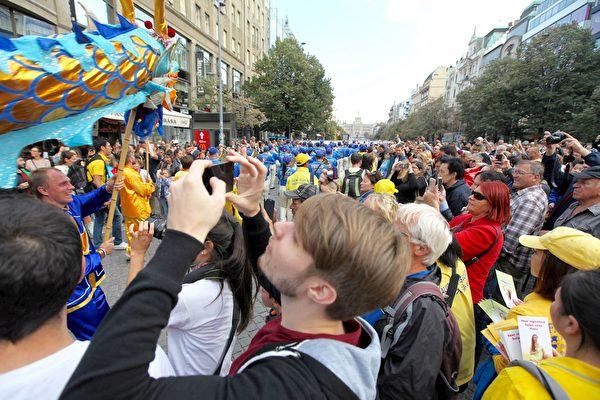

  
 法轮功游行队伍沿途人山人海。（明慧网）

  

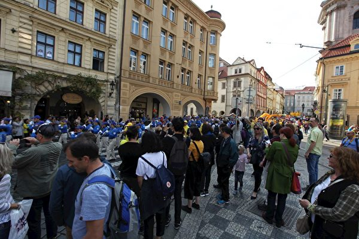

  
 法轮功游行队伍沿途人山人海，其中不乏中国游客。（明慧网）

  

瑞士法轮功学员潘女士在布拉格老城遇到一对正在拍婚纱照的大陆新婚夫妇，走过去祝福他们，俩人高兴地说：“谢谢阿姨！”

随后，潘女士给他们讲述了法轮功真相。

1992年，法轮功在中国传出，教人修心向善，遵循“真、善、忍”做人。修炼法轮功后，人们身体健康、道德提升。至今洪传世界一百多个国家和地区，所获褒奖数千份。1999年7月，中共江泽民集团开始迫害法轮功，因修炼的人数多于七千万中共党员。

谈话中潘女士得知那对年轻人曾经入过共青团和少先队。

潘女士说：“那块用死人的鲜血染红的红领巾，你们曾经在脖子上系过。你们想一想，那吉利吗？还能要吗？”新婚夫妇说，“那不吉利，不能要！”

潘女士给他们起了化名，做了三退并祝福：“祝你们美好甜蜜，平安幸福。”新婚夫妇高兴地回答：“谢谢阿姨！”说完，两人拥抱了潘女士。

来自德国的法轮功学员陈女士一路跟着游行队伍走，遇到一位来自北京的30岁左右的小伙子。

“‘善恶有报是天理’，共产党干的坏事和好人无关。‘三退’保平安！”陈女士和小伙子说到“三退”的事，他爽快地答应要退出中共。

另一对年轻人有些犹豫：“我们是党员，是政府机构人员，我们也知道共产党不好，但是我们就是吃的这碗饭，怎么办呢？退了之后我们怎么吃饭呀？”

陈女士说，“中共做了那么多的坏事，把优秀的人才都拉到它那个组织里去。如果不退出来，你还是它的一分子，因为发的誓约（你的那个把生命献给它）还在。”

两位年轻人听明白了，都同意“三退”。

“人心生一念，天地尽皆知。”“三退”的方法很简单，用化名、小名、别名都可以，并不影响人的生活和工作。

还有两位从德国来旅游的大陆男女青年在观看游行队伍时，女孩表示自己很想炼法轮功，和她在一起的男子也说对法轮功很有兴趣。

陈女士介绍他们去看《转法轮》（法轮功的主要著作）一书，两人一直很认真地听。

法轮功教人修炼“真、善、忍”做好人，告诉人生命的意义是返本归真，返回先天的本性上去。阅读《转法轮》就会明白这些道理。

当问到他们是否“三退”时，陈女士得知他们已经上大纪元的网站“三退”了。
 

<b>法兰克福“三退”小故事</b>
 

德国法兰克福市中心的保罗广场是个著名景点，也是所有到该市来的中国游客上下车的必到之地。当地的法轮功学员几乎每天都去那儿给中国人讲真相，陈女士也是其中的一位，已坚持了十几年。 

今年9月1日，几百名法轮功学员聚集到保罗广场。为了给中国人讲真相，他们在那里举行集会、炼功，之后举行游行活动。

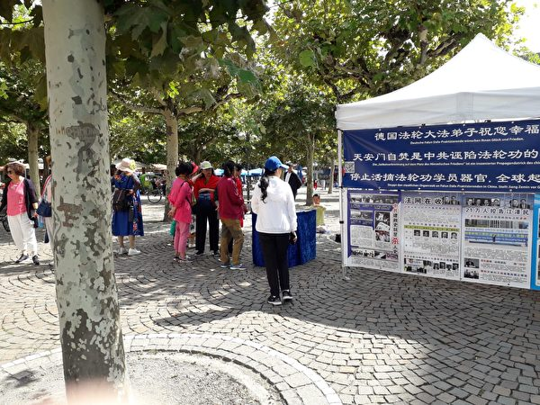

  
 中国游客在保罗广场看真相展板。（法轮功学员提供）

  

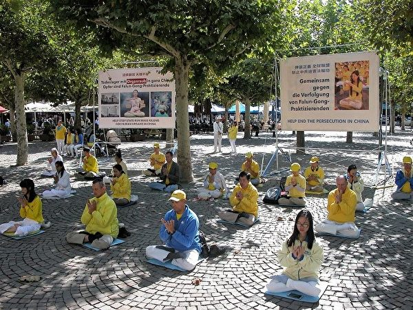

  
 2018年9月1日，法轮功学员在法兰克福保罗广场上炼功。（明慧网）

  

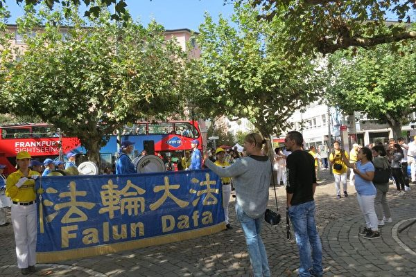

  
 2018年9月1日，天国乐团在保罗广场演奏，行人驻足观看。（余平／大纪元）

  

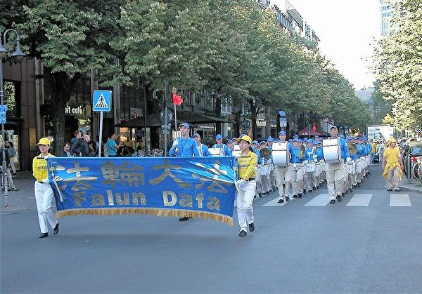

  
 2018年9月1日，游行队伍经过法兰克福市中心。（明慧网）

  

<b>没有比三退更重要的事</b>
  

正当天国乐团演奏乐曲时，陈女士看到一对父女在街对面，正望保罗广场看，就过街向他们问好。 

中年男士问：“这是什么团体？音乐真好听。”陈女士说是“法轮功”团体。

中年男士又问：“在这儿干什么？为什么？”陈女士回答说：“反对中共19年来对法轮功的迫害。今天法轮功学员正是为你们而来的。”

中年男士沉默不语，脸上露出感动的神情。他身边十几岁的女儿想离开，拉父亲走，说到对面去等旅游车。可父亲不动。

陈女士告诉他中共用谎言欺骗老百姓，颠倒黑白，告诉他“天安门自焚”是伪案。

2001年1月23日，天安门广场上演了五人“自焚”的闹剧，中共谎称是法轮功学员所为，而它实际上是中共一手导演的，是为了在全世界煽动对法轮功的仇恨。

 

让录像说话：自-焚者刘春玲是被警察用灭火器打死的--自-焚伪案疑点-女主角被当场灭口

 

<a href="https://github.com/bcdz/true01/blob/master/mp4/20170123_000925-video.mp4?raw=true"> “天安门真相” 影片下载</a>

 身边的女儿一个劲叫父亲走，父亲没搭理她，继续听真相。

陈女士告诉他，法轮功学员就是要告诉中国人真相，不上中共的当，并劝他赶快“三退”，为自己选择美好的未来。

男士马上答应三退，显出高兴的神情和女儿一块离开了。
 

<b>这就是天意 </b>
 

 这天，在游行的途中，来自其它城市的梅阿姨遇到了一行中国游客，他们看起来像是知识分子。 

梅阿姨刚开口给他们讲真相，那群人中有几位就反问她。 

一位游客说：“你们老是说‘天灭中共’，玄得很，说说看，哪里是天？哪有什么天意？”

梅阿姨回答说：“你们不信，也不怪你们，共产党灌输的就是无神论，我跟你们举一个例子吧。”

那帮人马上安静下来，都想听。

梅阿姨说：“2002年6月，在贵州省平塘掌布乡发现一块巨石，石壁上凸显一排字迹，可清晰地辨识有6个大字‘中国共产党亡’。这便是震惊世界的2.7亿岁的‘藏字石’。”
 

 

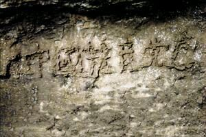

显现6个大字“中国共产党亡”的藏字石。（网络图片）

 

 梅阿姨打开手上的资料，给他们看这几个字。

梅阿姨问：“这不是天意吗？”游客惊讶地说：“哦，也没听说过，还真是的。”

梅阿姨又说：“这都登在海外的媒体上，你们却不能看到。给你们翻墙软件，多看看不被封锁的消息吧。”他们纷纷接过下载翻墙软件的信息卡片，其中有几个人做了“三退”。

<b>赶紧退出来</b>

还有一位法轮功学员遇到一个40岁模样的中国男性游客，就主动和他打招呼，给他递过去真相报纸。这位男性游客却说，“我都知道，我常常翻墙。”</b>

学员问：“你‘三退’了吗？”

游客说：“我入党都是十多年前的事了。那时上大学，我在学生会里干，别人硬是把我拉进党的，我也没缴党费。”

学员说：“尽管你没交党费，可你还是它的一分子。不退出来，你就会当它的陪葬品。中共把社会精英都拉进党，就是要害他们啊。给你起个化名，赶快退出来啊。”

游客一脸严肃地说：“好，好，那我赶紧退！”

<b>慕尼黑景点</b>

德国慕尼黑法轮功学员从今年4月份开始，坚持每周六在景点举办活动，给大陆中国人讲法轮功真相，协助他们“三退”，选择光明的未来。

长年在景点坚持讲真相的法轮功学员经常会遇到让他们难忘的情景。

 
  

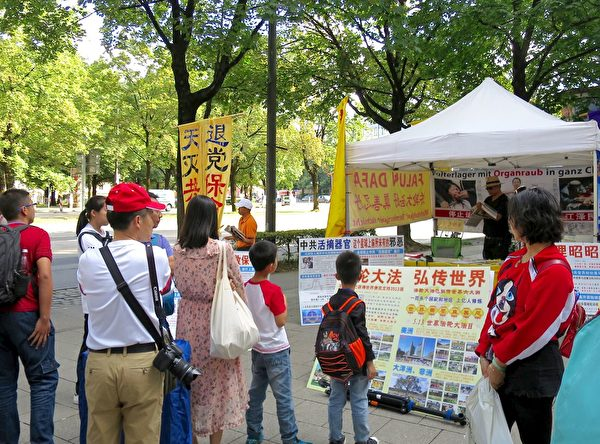

大陆游客阅读法轮功真相展板。（明慧网）

 

 
  

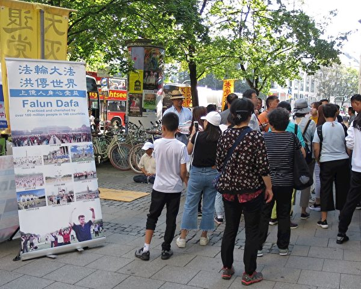

大陆游客阅读法轮功真相展板。（明慧网）

 

 
<b> 善恶有报真实不虚呀</b>
 

慕尼黑的陈女士回忆说：“有一次庆祝世界法轮大法日，大家都在打坐，展台那儿没有人，有一个看上去气度不凡、当官模样的中国人进到账篷里边寻找资料。我过去问他需要什么资料。他问有没有书（法轮功的书籍），我告诉他网上可以买到，或者在台湾、香港等地也可以买到。”

他说退休前他曾在政法委工作过，是负责法轮功这块的。

政法委是中共控制公、检、法、司、国安工作的最高机构，在江泽民迫害法轮功后，成为主要指挥系统，实施制度性和系统性的迫害。

这位官员讲：“我认识你们的人（有法轮功学员给他讲过真相），所以我没有抓你们的人，也没有打过。”

陈女士得知他还没有做过“三退”，就跟他讲三退的道理。他表示，“我早就不信任共产党了，我知道它特别坏。”陈女士建议他用化名退出，他却说，“还是用真名吧？干嘛要用化名呀？”

陈女士记下他的名字后，他又问：“会不会有重名呀？”陈女士告诉他，“老天爷看的是人的一念，不在于叫什么名字。”

这位官员还让他的下属也做“三退”，下属也同意了。

之后，陈女士又和他们谈起了当前中国的社会形势，很多政法委、“610”办公室（专门迫害法轮功的非法组织）的头头纷纷都落马了。

陈女士表示，“很多迫害法轮功的人都没有好结果。”这位官员马上说：“这一点我太认同了，你说得太对了。凡是在我们那里迫害法轮功特别狠的人，没一个有好结果的：死的死、病的病、得癌症的都有；死也不是正常死亡，有的是暴死，有得病的也是暴病。”

最后，官员感慨说，善恶有报真实不虚呀。

其中最知名的如，前任中央政法委书记周永康是江泽民迫害法轮功的核心人物，于2015年6月11日落得被判无期徒刑的下场。

2016年，前中共河北省委常委、政法委书记张越，前辽宁省委常委、政法委书记苏宏章，河南省委前常委、政法委书记吴天君等均落马。

<b>天天念天灭中共</b>

潘女士今年80岁了，每天都到景点给中国游客讲真相。

她说：“中国人一下车，就能看到大横幅和真相展板。我有的时候观察游客的表情，他们的眼睛都忙不过来，看看横幅、展板、看看炼功；有的人表情都不一样了，有的在拍照。”

一次，导游正在讲话，一位游客请求潘女士将她手里的“法轮大法好”横幅打开。他给她和横幅照相，之后冲着她竖起了大拇指。

还有一次，两个小伙子一下大巴，就给她和横幅照相。小伙子表示，“我们给你宣传去！”

法轮功于1992年第一次在中国传出，至今已洪传世界一百多个国家。创始人李洪志先生和法轮功在海外已获3500多项褒奖。各族裔的人都知道“法轮大法好”。

潘女士曾给一位50岁左右的男士讲真相。男士说，“你讲的这些我都懂，共产党太坏了。”他同意退出中共。

潘女士又告诉他，要跟家里人讲真相，让家人也念“法轮大法好、真善忍好”。

男士抬头看看横幅说：“我不但要念‘法轮大法好’、‘真善忍好’，我还要念‘天灭中共’，天天念‘天灭中共’。”

<b>美国会议员发起决议案</b>

2018年5月9日，在美国国会举办的“声援三亿中国人三退”研讨会上，美国联邦众议员达纳‧罗拉巴克（Dana Rohrabacher）赞赏退党义工和三退民众的勇气。

他说：“‘退党’非常重要，它给了共产邪恶体制之内的人们退出的机会，让他们不再参与镇压自己的同胞，不再与中共一道成为世界的威胁。”

“我知道他们（法轮功学员）的付出——在似乎没有任何机会压倒控制中国的中共流氓政权的情况下，他们坚定、顽强地站出来，鼓舞著其他中国人，也鼓舞了整个世界。”
 

  

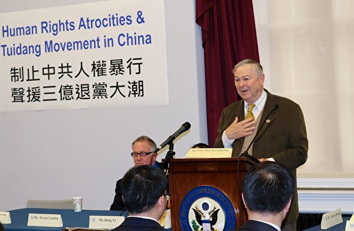

在5月9日的研讨会上，罗拉巴克（Dana Rohrabacher）议员赞赏退党义工和三退民众的勇气。（大纪元）

 

 2018年6月8日，罗拉巴克议员发起了《第932号决议案》，“表达声援中国民众退出中国共产党及其附属组织的退党大潮，要求立即停止迫害法轮功。”

此外，美国国会立法及行政当局中国委员会（CECC）在2012年年底将“全球退党服务中心”提交的一份报告录入美国国家政府档案，作为美国国家印刷总局刊物发行。

资料来源：明慧网、大纪元   #
 
 
<a href=#list><h4 align="right">回目錄</h4></a>
