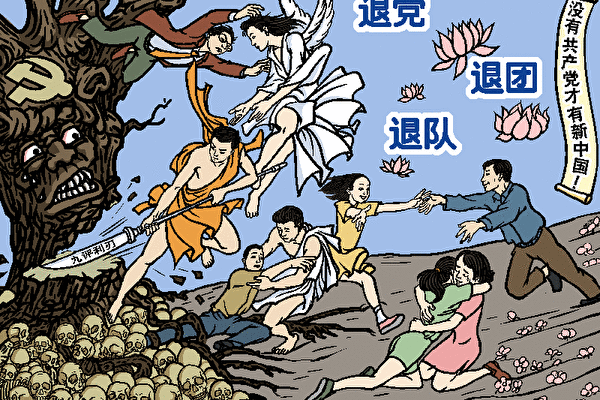
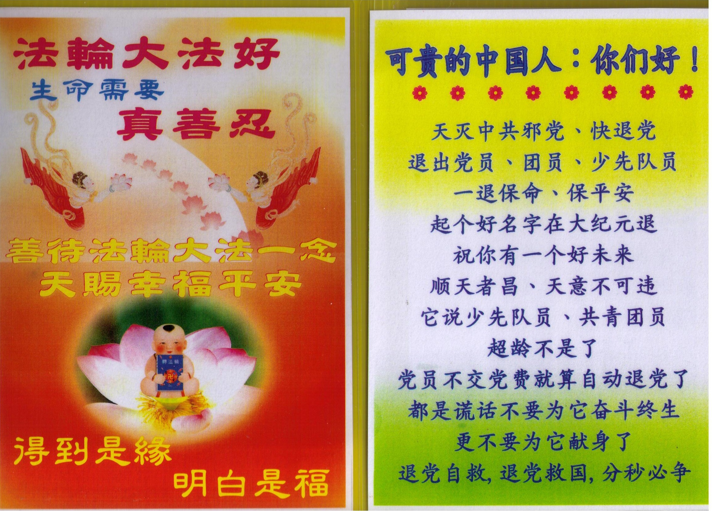
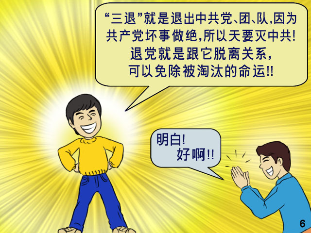

<h1 align="center"><b>大纪元郑重声明</b></h1>

<h1>广大的中国民众：共产党的末日就要到了。但是这个邪恶的党（魔教）在历史上却对众生、对神佛犯下了滔天大罪，神一定要清算这个恶魔。

如果有一天，神指使人类的谁对共产党清算时，也一定不会放过那些所谓坚定的邪恶党徒。我们郑重声明：所有参加过共产党与共产党其它组织的 (被邪恶打上兽的印记的)人，赶快退出，抹去邪恶的印记。一旦谁对这个魔教清算时，大纪元储存的记录可以为声明退出共产党和共产党其它组织的人作证。

  天网恢恢，善恶分明；苦海有边，生死一念。曾被历史上最邪恶的魔教所欺骗的人，曾被邪恶打上兽的印记的人，请抓住这稍纵即逝的良机！

大纪元 
2005年1月12日
</h1>

<a href="https://github.com/bcdz/true01/issues"><b>了解更多，點 Issues → New issue 可留言</b></a>

朋友 您好，在此相遇就是缘分，共产党一直说它是人民的大救星，这是天大的谎言，事实正相反，它的命都是您给它的。自古以来，善恶有报是天理，迫害修炼人更是罪大恶极。古代有个皇帝周世宗，下诏灭佛，并亲自用斧头劈佛像的胸口。五年之后他本人胸口毒疮迸发死于非命。可共产党迫害了上亿的修炼人，还活摘人体器官，为什么还没被消灭呢？因为这恶魔几乎绑架了所有的中国人当它的人质、挡箭牌，让神佛不忍降下巨灾。它让我们从小加入少先队，然后入团，入党，如果此时消灭它，加入过党、团、队的中国人都会成了陪葬品。现在已有超过二亿九千万人觉醒，退出了共产党、共青团和少先队组织，也叫三退，得到了未来的平安，善良的您不要落下。

法轮大法是佛法，法轮功学员按照“真、善、忍”的法理做好人，在中国大陆公开传播的七年中，显著提高了修炼者的健康和道德水平，迅速传遍全国。1998年，前人大委员长乔石向中央递交了调查报告，结论是：“法轮功与国于民有百利而无一害。”而江泽民出于妒嫉，不顾政治局其他常委的反对，仍然疯狂地发动了迫害。后来又自编自导出“天安门自焚假案”欺骗善良的民众，煽动民众仇视法轮功。近几年来，薄熙来、周永康、徐才厚等迫害法轮功的高官纷纷落马，血腥罪行曝光，包括大规模活体摘取法轮功学员器官出售牟利。而且迫害元凶江泽民已经在全世界三十几个国家和地区以反人类罪，酷刑罪，群体灭绝罪被告上了法庭。尤其在中国大陆和海外已有20多万人向中国最高法院，最高检察院实名控告江泽民。各国的国会议员、政要、知名人士也站出来声援，目前全球共计28个国家和地区、超过200万民众联名签署要求法办江泽民。对江泽民迫害法轮功的世纪大审判势在必行。

古话说“识时务者为俊杰”，全国很多官员现在都知道不能迫害法轮功学员了，还有很多官员在搜集迫害证据，给自己留后路。无论您是谁，在大是大非面前都要摆放自己的位置，善待法轮功学员，告诉亲友真相，给自己留退路，积福德。现在已有超过二亿九千万中国人用自己的良知与正义，用化名，小名或真名退出中共的党、团、队组织。三退不花您一分钱，却会让好人一生平安！俗话说“君子不立于危墙之下”，我们在此相遇就是机缘，请您抓紧这个时机三退。

 
 
 
